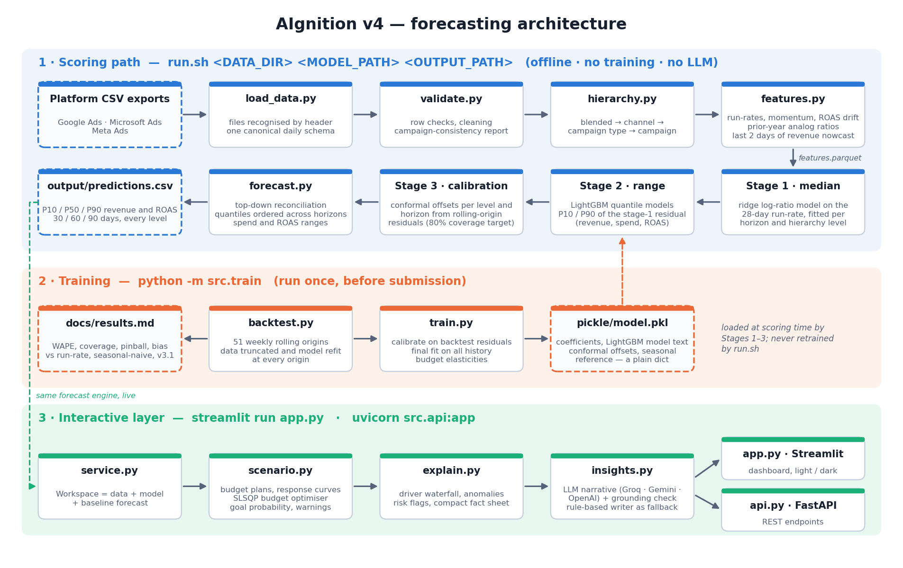

# AIgnition 3.0 — Probabilistic Revenue Forecasting for E-commerce Marketing

An AI-assisted forecasting utility for digital marketing agencies: P10 / P50 / P90 revenue and ROAS for the
next 30, 60 and 90 days, across Google Ads, Microsoft Ads and Meta Ads, at blended, channel, campaign-type and
campaign level, with a budget simulator and an LLM layer that explains the forecast.

**Team:** The Trident — Shiva Krishna Sherikar (Team Lead), Kamatam Rohit, C. Namish
**College:** Malla Reddy College of Engineering and Technology
**Hackathon:** AIgnition 3.0 (NetElixir)

---

## Results at a glance

Accuracy is measured one way only: a **rolling-origin backtest**. At each of 51 weekly origins the data is cut
at that date, the model is refitted on what was visible, and the following 30 / 60 / 90 days are forecast and
scored. Nothing is filtered out. Full tables: [`docs/results.md`](docs/results.md) (generated by training).

| Blended revenue | 30 days | 60 days | 90 days |
|---|---:|---:|---:|
| WAPE, no budget information | **40.9%** | **38.2%** | **34.3%** |
| WAPE, budget plan known | **25.8%** | **25.0%** | **25.4%** |
| Run-rate baseline | 74.6% | 85.2% | 93.8% |
| Seasonal-naive baseline | 47.4% | 41.1% | 37.7% |
| P10–P90 coverage (target 80%) | 87% | 80% | 82% |

Against the previous version of this project (v3.1), put through the same protocol on the same origins and
series:

| Level, 30-day horizon | WAPE v3.1 | WAPE v4 | Coverage v3.1 | Coverage v4 |
|---|---:|---:|---:|---:|
| Blended | 56.3% | **30.5%** | 52% | **88%** |
| Channel | 66.7% | **35.0%** | 44% | **84%** |
| Campaign type | 78.0% | **46.7%** | 66% | **87%** |
| Campaign | 113.5% | **56.9%** | 87% | 78% |

v3.1 reported 35.8% WAPE, but on a measurement that gave the model the realised future spend, filtered small
rows and let training targets overlap the holdout. Scored forward, it under-forecast by about half and its
output file put a $0 median on Google Search.

**What the numbers say.** Roughly 25% is the floor this account's volatility allows even when the budget is
known. Without a budget plan the extra error comes from peak season, whose size is a budget decision. That is
why the budget simulator is a core part of the product and not an add-on.

---

## Quick start

Python 3.10 – 3.13.

```bash
pip install -r requirements.txt
```

Score whatever is in a data folder (this is the command the test pipeline runs; offline, no training):

```bash
bash run.sh ./data ./pickle/model.pkl ./output/predictions.csv
```

Launch the dashboard:

```bash
streamlit run app.py
```

Retrain, re-run the backtest and regenerate `docs/results.md` (about 3 minutes):

```bash
python -m src.train
```

Run the tests:

```bash
python -m pytest tests -q
```

Start the API:

```bash
uvicorn src.api:app --port 8000
```

On Windows without Git Bash, `run.bat` takes the same three arguments as `run.sh`.

### LLM keys (optional)

Copy `.env.example` to `.env` and add a key for Groq, Gemini or OpenAI. The insight layer tries each configured
provider and key in turn and picks a model the key can actually use. Without a key the same sections are
written by rules from the same facts. `run.sh` never touches the network.

---

## Output contract

`predictions.csv` has one row per (series, horizon): 154 series × 3 horizons = 462 rows on the sample data.

| Column | Meaning |
|---|---|
| `channel` | `google`, `meta`, `bing`; `all` for the blended total |
| `campaign_type` | `SEARCH`, `PERFORMANCE_MAX`, `SHOPPING`, …; empty on channel and blended rows |
| `campaign_name` | Campaign name; empty above campaign level |
| `horizon_days` | 30, 60 or 90 days after the last day every channel covers |
| `p10_revenue`, `p50_revenue`, `p90_revenue` | Revenue quantiles for the whole window |
| `p10_roas`, `p50_roas`, `p90_roas` | ROAS quantiles for the whole window |

Guarantees, each covered by a test: quantiles are ordered and non-negative; channels sum to the blended P50 and
campaign types to their channel; no quantile shrinks as the horizon grows; every campaign in the data has a row.
`output/forecast_detail.csv` adds spend forecasts, driver contributions and level labels.

---

## How it works



The scoring path (blue) is what `run.sh` executes. Training (orange) runs once and produces `pickle/model.pkl`
and the published results. The dashboard and API (green) reuse the same forecast engine. Module-level detail:
[`docs/architecture.md`](docs/architecture.md).

1. **Target.** The log-ratio of the next 30/60/90-day total to the last-28-day run-rate. One model serves
   series from $10 to $1M, and "no information" means "forecast the run-rate".
2. **Stage 1, the median.** A ridge model with no drift term, fitted per horizon and hierarchy level, on
   momentum beyond a noise dead-zone, the longer-run level, ROAS drift and prior-year analog ratios. It is linear
   in logs, so every forecast decomposes exactly into drivers.
3. **Stage 2, the range.** LightGBM quantile models on stage-1 residuals: wider for small, volatile or
   peak-season series.
4. **Stage 3, calibration.** Conformal offsets from out-of-sample residuals, per hierarchy level and horizon,
   bring coverage to target.
5. **Hierarchy.** Each level is forecast directly, then reconciled top-down.
6. **Budget response.** Revenue elasticity to spend (about 0.82–0.87) gives a concave response curve per
   campaign type; a scenario at expected spend reproduces the baseline exactly.
7. **Data realism.** The forecast starts after the last day every channel covers; revenue for the final two
   days is nowcast from spend because conversions are still being attributed.

LightGBM was tried for the median and lost to the linear model in the backtest; it is used where it wins, on
the range. A further twelve variants (ROAS mean-reversion terms, robust loss, smoothed seasonal analogs, campaign
share allocation, forecast combination, other range-model settings) were tested on the same backtest and not
adopted because none improved it consistently. The full list is in
[`docs/methodology.md`](docs/methodology.md).

---

## The dashboard (demo workflow)

| Tab | What an analyst does there |
|---|---|
| **Forecast** | Reads the key message, the P50, the P10–P90 range and ROAS for all three horizons; sees history against the forecast, the driver waterfall, the cumulative forecast cone, the chance of hitting a revenue goal, channel bars, ROAS ranges by campaign type, this year against earlier years, and the campaign types moving most against their run-rate |
| **Explore** | Drills from channel to campaign type to campaign; inspects any series' history, forecast, drivers and seasonality, and each channel's track record of past forecasts |
| **Budget** | Enters future media budgets three ways: channel sliders, planned dollars per campaign type, or an uploaded plan CSV. One-click starting plans: ±20%, last year's spend for the same window, the optimiser's split. Sees revenue, ROAS and incremental ROAS respond along fitted response curves; saves named plans and compares them; gets a warning when a plan exceeds anything spent before |
| **AI insights** | Reads the LLM's causal summary (each driver tagged *model-attributed* or *hypothesis*), anomaly interpretations, risks and recommended actions, with a count of quoted numbers traced back to the model's facts; asks follow-up questions in chat |
| **Data quality** | Reviews validation and campaign-consistency checks, channel coverage, and weeks that broke pattern |
| **Model & backtest** | Sees error by level against baselines and the previous pipeline, range coverage, and a replay of every past forecast against what happened, per channel |

The sidebar has a **Dark mode** switch that restyles widgets, tables and charts together (each mode has its
own colour-blind-safe chart palette); open the app with `?theme=dark` to start in dark mode. Headline tiles
carry a 12-week sparkline or a P10–P90 range bar.

Data comes from the project's `data/` folder or from CSVs uploaded in the sidebar. Exports: the submission
file, the detailed forecast, and a client brief in Markdown.

---

## AI integration

The LLM interprets; it does not forecast and never sees raw rows.

- **Input:** a numeric fact sheet of about 3,000 tokens: forecasts and ranges, the model's exact driver
  decomposition, statistically detected anomalies, rule-based risk flags, marginal ROAS, the optimiser's moves
  and the backtest reliability.
- **Output:** a fixed JSON schema: headline, executive summary, causal drivers, anomaly interpretations, risks,
  recommendations, confidence.
- **Grounding:** every number the LLM writes is checked against the fact sheet; the dashboard shows how many
  were traced and lists any it derived itself.
- **Resilience:** provider, key and model fallback; a rule-based writer when no key works.

---

## Project structure

```
├── run.sh / run.bat          Scoring entry point (features → predictions)
├── app.py                    Streamlit dashboard
├── requirements.txt          Pinned dependencies
├── data/                     Sample platform exports (replaced at test time)
├── pickle/model.pkl          Trained bundle (plain dict + LightGBM model text)
├── output/predictions.csv    Written by run.sh
├── src/
│   ├── config.py             All constants
│   ├── load_data.py          CSV recognition and harmonisation
│   ├── validate.py           Validation, campaign-consistency checks, cleaning
│   ├── hierarchy.py          Daily four-level hierarchy, forecast origin
│   ├── features.py           Causal features, targets, seasonal reference
│   ├── model.py              Stage 1–3, elasticity, bundle I/O
│   ├── forecast.py           Assembly, reconciliation, spend plans, output format
│   ├── backtest.py           Rolling-origin backtest and metrics
│   ├── train.py              Backtest → calibrate → fit → docs
│   ├── scenario.py           Response curves, optimiser, goal probability
│   ├── explain.py            Driver waterfall, anomalies, risks, seasonality overlay, fact sheet
│   ├── charts.py             Every dashboard chart as a plain Plotly figure (light and dark palettes)
│   ├── theme.py              Light / dark themes, stylesheet, sparkline and range-bar graphics
│   ├── insights.py           LLM layer, grounding check, rule-based writer
│   ├── service.py            Workspace shared by dashboard and API
│   ├── api.py                FastAPI endpoints
│   ├── generate_features.py  run.sh step 1
│   └── predict.py            run.sh step 2
├── tests/                    45 tests: data, features, forecast contract, product, dashboard
└── docs/                     methodology, architecture, results (generated), backtest CSVs
```

---

## Verified environments

`run.sh` and the test suite were run in freshly created virtual environments with only `requirements.txt`
installed:

| Python | Environment | Result |
|---|---|---|
| 3.13.5 | fresh venv, pinned `requirements.txt` (NumPy 2.1.3, pandas 2.2.3) | 45 tests pass |
| 3.10.8 | fresh venv, pinned `requirements.txt` | 45 tests pass |
| 3.10.8 | development machine (NumPy 1.26.4, pandas 2.2.2) | 45 tests pass |

`predictions.csv` is byte-identical across all three, and from a copy of the repository containing only its
committed files.

`run.sh` was also exercised on truncated histories (60, 20, 5 and 1 day), earlier cut-off dates, a single
channel, renamed files, dirty rows and an empty folder; see
[`docs/SUBMISSION_CHECKLIST.md`](docs/SUBMISSION_CHECKLIST.md).

---

## Assumptions and limitations

- Platform-attributed revenue is the source of truth; no attribution modelling or MMM.
- Meta's `conversion` column is read as purchase value (evidence in the methodology).
- Without a budget plan the model has to forecast spend, which is the largest avoidable source of error.
- A promotion ending can halve revenue per dollar within weeks. No budget plan fixes that; it is why the P10
  can sit far below the median.
- The elasticity is observational, bounded, and flagged when a plan extrapolates beyond historical spend.
- Campaign-level forecasts are directional; plan at channel or campaign-type level.

## More

- [`docs/methodology.md`](docs/methodology.md): preprocessing, model selection, assumptions, limitations, AI strategy
- [`docs/architecture.md`](docs/architecture.md): stack, pipeline, LLM workflow, API
- [`docs/results.md`](docs/results.md): every backtest table
- [`docs/SUBMISSION_CHECKLIST.md`](docs/SUBMISSION_CHECKLIST.md)
