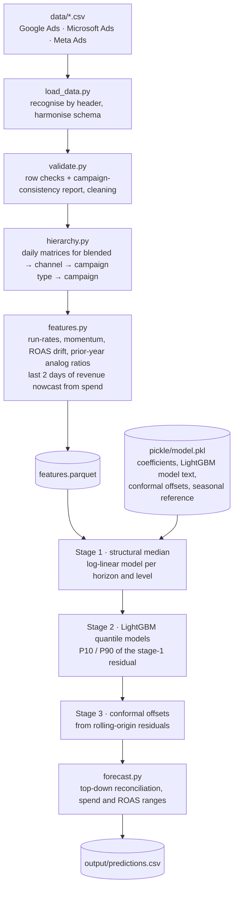
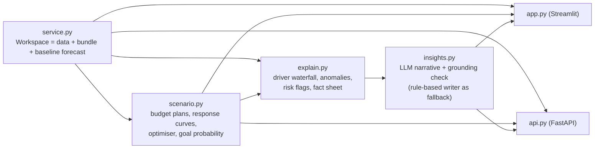

# Architecture overview

## Stack

| Layer | Technology | Where |
|---|---|---|
| Forecasting core | NumPy / pandas (structural model, features), LightGBM (quantile models), SciPy (budget optimiser) | `src/` |
| Scoring entry point | Bash + two Python commands, fully offline | `run.sh` |
| Backend API | FastAPI + Uvicorn | `src/api.py` |
| Frontend | Streamlit + Plotly | `app.py` |
| LLM layer | Any OpenAI-compatible chat endpoint: Groq (default), Gemini, OpenAI | `src/insights.py` |

## Overview

## Forecasting pipeline

`run.sh` executes exactly the left-to-right path above: `src/generate_features.py` (data → `features.parquet`)
then `src/predict.py` (features + model → `predictions.csv`). No training, no network, no LLM.

## Interactive path

## Modules

| Module | Responsibility |
|---|---|
| `src/config.py` | Every constant: horizons, coverage, lag, seasonality, model and LLM settings |
| `src/load_data.py` | Platform CSVs → one canonical daily frame; files recognised by header, then name |
| `src/validate.py` | Validation + campaign-consistency report; cleaning |
| `src/hierarchy.py` | Four-level daily hierarchy and the forecast origin |
| `src/features.py` | Causal origin-level features, targets, seasonal reference |
| `src/model.py` | Stage 1–3 fitting and scoring, elasticity, bundle save/load |
| `src/forecast.py` | Assembly into P10/P50/P90 revenue, spend, ROAS; reconciliation; spend plans; output format |
| `src/backtest.py` | Rolling-origin backtest, metrics, comparison with the previous pipeline |
| `src/train.py` | Backtest → calibration → final fit → `model.pkl` and `docs/` |
| `src/scenario.py` | Response curves, budget optimiser, goal probability, extrapolation warnings |
| `src/explain.py` | Driver decomposition, anomaly detection, risk flags, fact sheet |
| `src/insights.py` | LLM provider fallback, prompts, grounding check, rule-based writer |
| `src/charts.py` | Every dashboard chart as a plain Plotly figure, with a light and a dark palette |
| `src/theme.py` | Light / dark themes: Streamlit widget theme, stylesheet, inline sparkline and range-bar graphics |
| `src/service.py` | One workspace object shared by dashboard and API |
| `src/api.py` | REST endpoints |
| `src/generate_features.py`, `src/predict.py` | The two commands `run.sh` runs |

## LLM integration workflow

1. `explain.build_facts` turns the forecast into a compact numeric fact sheet: forecast and ranges per level,
   the model's exact driver decomposition, recent anomalies, risk flags, marginal ROAS, optimiser output and
   backtest reliability. Raw rows are never sent.
2. `insights.generate_insights` sends the fact sheet with a fixed JSON schema: headline, executive summary,
   causal drivers (each tagged *model-attributed* or *hypothesis*), anomaly interpretations, risks,
   recommendations, confidence.
3. Providers, keys and models are tried in order. A rejected key or a rate-limited model falls through to the
   next; hosted model line-ups are discovered at run time rather than hard-coded.
4. `check_grounding` extracts every number the LLM wrote and checks it against the fact sheet. The dashboard
   shows how many were traced and lists any the LLM derived itself.
5. If no key works, a rule-based writer fills the same sections from the same facts.

## API endpoints

| Method | Path | Description |
|---|---|---|
| GET | `/health` | Model present, LLM providers configured |
| POST | `/validate` | Validation and campaign-consistency report |
| POST | `/forecast` | Baseline P10/P50/P90 revenue, spend and ROAS at every level |
| POST | `/simulate` | Forecast under budget multipliers by channel or `channel\|CAMPAIGN_TYPE` |
| POST | `/optimise` | Revenue-maximising split of a total budget, with bounds |
| POST | `/insights` | Causal summary, anomalies, risks, recommendations, fact sheet |
| GET | `/metrics` | Backtest report and fitted elasticities |

## Deployment notes

- Python 3.10 – 3.13. Dependencies pinned in `requirements.txt`.
- `pickle/model.pkl` is a plain dict of floats, lists and LightGBM model text, so it does not depend on the
  version of any library class when unpickled.
- LLM keys live in `.env` (`GROQ_API_KEY`, optional `GROQ_API_KEY_FALLBACK`, `GEMINI_API_KEY`,
  `OPENAI_API_KEY`). Set `AIGNITION_DISABLE_LLM=1` to force the rule-based writer.
